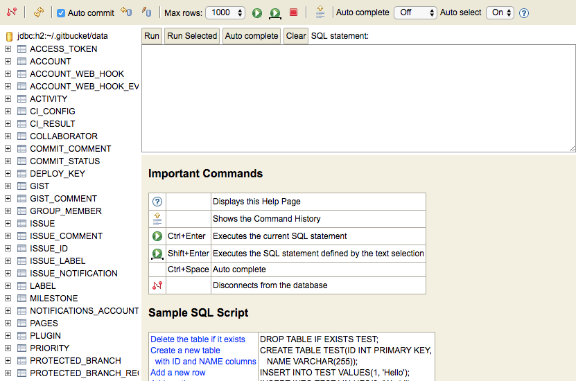

gitbucket-h2console-plugin
========
A GitBucket plugin that adds H2 console to the administration console.

Since GitBucket 4.21.0, H2 console has been dropped from the administration console because a new database viewer was introduced. If you still need H2 console, you can add it by installing this plugin. 

## Compatibility

Plugin version | GitBucket version
:--------------|:--------------------
1.2.x -        | 4.32.x -
1.1.x -        | 4.23.x -
1.0.x -        | 4.21.x -

## Installation

Download jar file from [the release page](https://github.com/takezoe/gitbucket-h2console-plugin/releases) and put into `GITBUCKET_HOME/plugins`.

## Build

Run `sbt assembly` and copy generated `/target/scala-2.12/gitbucket-h2console-plugin-assembly-x.x.x.jar` to `~/.gitbucket/plugins/` (If the directory does not exist, create it by hand before copying the jar), or just run `sbt install`.
